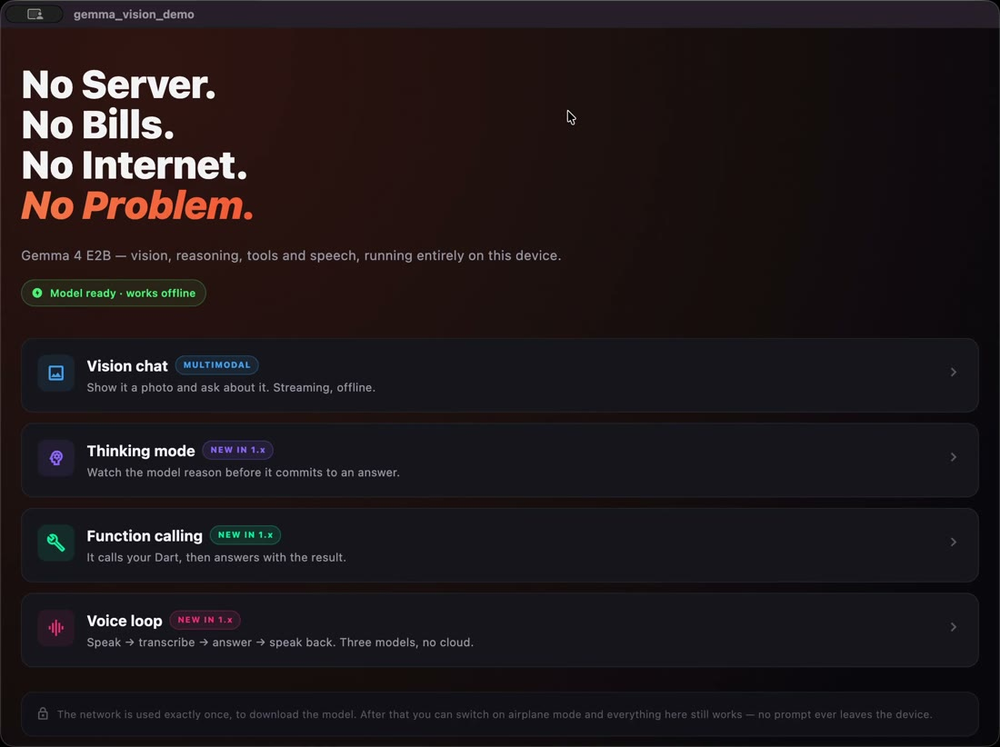
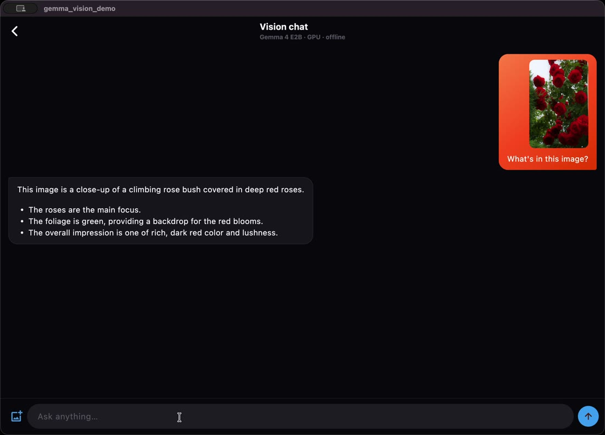
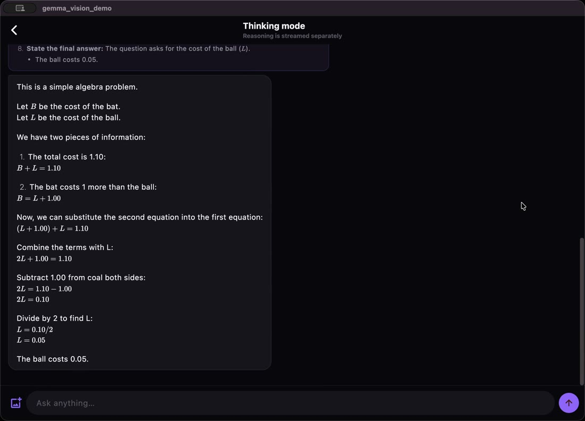
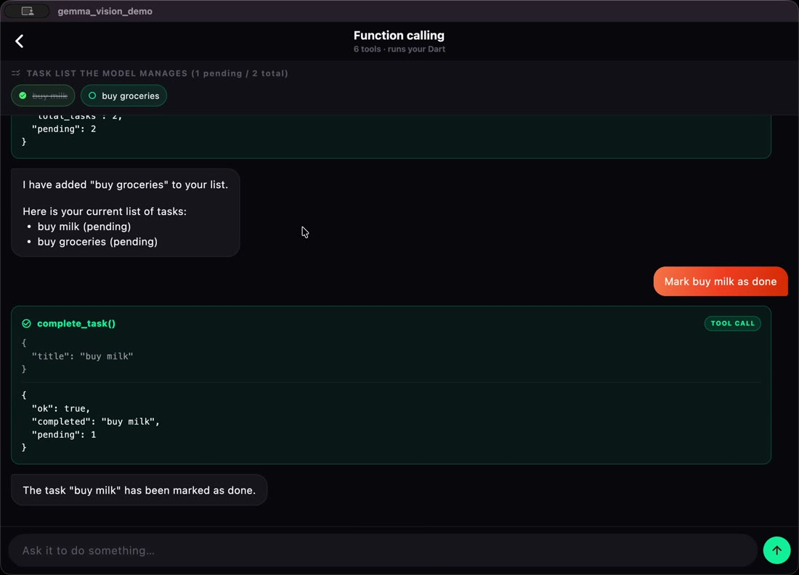
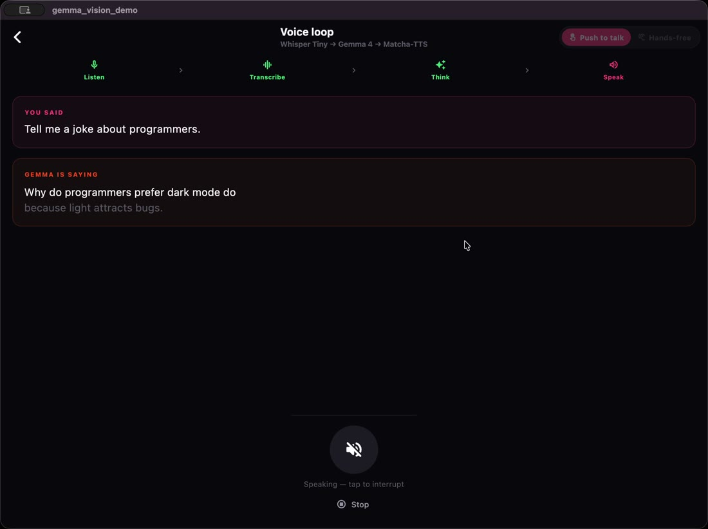

# Gemma On-Device Demo

A Flutter app that runs Google's Gemma 4 E2B model directly on your phone or Mac. It can look at a photo, show its reasoning, use functions in the app, and hold a spoken conversation. The internet is only used once, to download the model. After that you can switch on airplane mode and everything still works.

I built it for my talk, **Building On-Device AI Apps with Flutter and Gemma**, using [flutter_gemma](https://pub.dev/packages/flutter_gemma) 1.8.

## What it does

- **Vision chat**: attach a photo and ask about it. The answer appears as it's written.
- **Thinking mode**: the model works through the problem first. Its reasoning shows in a separate section, above the answer.
- **Function calling**: the model can use six tools that change what's on screen, like adding a task to a to-do list or changing the app's accent colour. Ask it to add a task and then read your list back, and it uses two tools in a row.
- **Voice loop**: ask a question out loud and hear the answer. Three models run on the device: one turns your speech into text, Gemma writes the reply, and one reads it aloud. It works with push-to-talk or hands-free.

## Screenshots

<table>
  <tr>
    <td></td>
    <td></td>
    <td></td>
  </tr>
  <tr>
    <td></td>
    <td></td>
    <td></td>
  </tr>
</table>

## From the talk

- **Slides:** [akanshajain.dev/talks/on-device-ai](https://akanshajain.dev/talks/on-device-ai/)
- **Codelab:** [akanshajain.dev/codelabs/on-device-ai](https://akanshajain.dev/codelabs/on-device-ai/), a step-by-step guide to building a smaller version of this app
- **Article:** [Why I think on-device AI changes mobile architecture](https://medium.com/flutter-community/why-i-think-on-device-ai-changes-mobile-architecture-3cc6b09afd83)

## Run it

This project uses [FVM](https://fvm.app) to pin Flutter 3.47.3, so it won't affect your other Flutter projects. flutter_gemma 1.x needs Flutter 3.44 or newer.

```bash
dart pub global activate fvm   # if you don't have FVM yet
fvm install                    # installs the version in .fvmrc
fvm flutter pub get
fvm flutter run -d macos       # or pick a connected phone
```

Use `fvm flutter`, not plain `flutter`. An older Flutter on your machine will refuse to install the dependencies.

You don't need a Hugging Face account or token. Every model this app uses is public.

## Models

| What it does | Model | Download |
| --- | --- | --- |
| Understands text and images, writes replies | Gemma 4 E2B (`.litertlm`) | 2.6 GB |
| Turns speech into text | Whisper Tiny | 151 MB |
| Turns text into speech | Matcha-TTS | 94 MB |

Gemma downloads the first time you open any demo, and all four demos share it. The two speech models only download when you open the voice loop.

Why these particular models:

- **The `.litertlm` format**, because one file works on Android, iOS and macOS. The older `.task` format only runs through MediaPipe and doesn't work on desktop.
- **Whisper Tiny instead of Moonshine Tiny**, because the Moonshine build only listens to five seconds of audio and quietly cuts off anything longer.
- **Matcha instead of Inflect-Nano**, because Inflect is smaller and faster, but its speech was hard to understand in my testing.

## Requirements

- **Android:** an arm64 phone on Android 8.0 (API 26) or newer, with plenty of free memory. Most emulators on Intel Macs and PCs won't work, because the engine only includes arm64 code. The build is limited to arm64, so you find out when you build rather than when the model starts.
- **iOS:** iOS 15.0 or newer, on a real iPhone. The Simulator can only use the CPU, because it can't give the GPU a single block of memory larger than 256 MB, and the model needs more.
- **macOS:** an Apple Silicon Mac on macOS 12.0 or newer. This is the easiest target while developing.

Web isn't supported. The web build of Gemma 4 E2B only handles text, so the vision demo wouldn't work.

## How the code is organised

```text
lib/
├── main.dart                 starts flutter_gemma and registers the engine
├── theme.dart                colours, type and shared styles
├── gemma/
│   ├── model_catalog.dart    every model link and setting in one place
│   ├── gemma_service.dart    loads the model once and opens conversations
│   ├── demo_tools.dart       the tools the model can use, and what they do
│   ├── gemma_failure.dart    turns errors into messages people can act on
│   ├── model_text.dart       cleans up the model's text before it's shown
│   ├── sentence_chunker.dart splits a reply into sentences as it arrives
│   ├── voice_activity_detector.dart  decides when you start and stop talking
│   └── voice_turn.dart       listen, think, speak: one voice turn
├── screens/                  home, model download, chat, tools, voice
├── widgets/                  chat bubbles, message box, voice controls
└── utils/audio_converter.dart  converts between WAV files and raw audio
```

## Things that tripped me up

**Load the model once.** Loading the model is the slow, memory-heavy part. `GemmaService` loads it a single time, and each screen opens its own conversation on top of it. Leaving a screen closes that conversation, never the model.

**Photos only work in the main conversation.** flutter_gemma has two ways to start a conversation. `createChat()` uses the model's main conversation. `openChat()` opens extra conversations that share the same loaded model. The engine keeps only one conversation active at a time, and when it switches it rebuilds the others from their saved text. A photo can't be rebuilt from text, so extra conversations reject images. The vision demo uses `createChat()`. That's safe here because only one screen is open at a time.

**Two settings you have to set yourself.** Use `ModelType.gemma4`, not `gemmaIt`, so tools go through Gemma 4's own tool-calling format. And always pass `ModelFileType.litertlm`. The file type decides which engine opens the model, it isn't worked out from the file name, and it defaults to `.task`, which sends your file to an engine that can't read it.

**Clean up the text before showing it.** Gemma 4 sends tool calls and reasoning through the same stream as the answer. flutter_gemma usually separates them, but I still saw raw tool-call data and reasoning markers show up in the visible reply. `ModelText.sanitize` cleans the whole reply received so far rather than each new piece, because a marker can be split across two pieces.

**Tools return errors instead of throwing.** If a tool throws an exception, it ends the model's reply. `DemoTools.execute` returns an `{'error': ...}` message instead. The model reads it and can correct itself or explain what went wrong.

**The voice loop speaks sentence by sentence.** Text-to-speech needs complete text before it can make any audio, so if you wait for the whole reply, the app stays silent until Gemma has finished writing. `VoiceTurn` splits the reply into sentences as they arrive and starts preparing each one's audio straight away, so speaking starts after the first sentence. I built this before noticing that flutter_gemma_speech's `VoiceSession` already does it: pass `streamAudio: true` (added in version 0.4.3) and it speaks clause by clause while the model is still writing. If you're starting fresh, try that first. Even so, in my testing on a Mac, turning speech into text and text into speech are the slowest steps in the loop.

**Hands-free listening uses a volume threshold.** The package doesn't detect when you start or stop talking, so `VoiceActivityDetector` does it. Speech starts when the microphone level goes above a threshold, which is −40 dB by default, and ends after about 2.6 seconds of quiet. If a fan or air conditioner keeps setting it off, you can adjust the sensitivity on the voice screen.

**Less randomness than Google's defaults.** Google suggests temperature 1.0, topP 0.95 and topK 64 for Gemma 4. These settings control how adventurous the model is when picking each next word. With them, this small model sometimes switched language mid-sentence, like dropping in the Japanese word for "source". Chat uses 0.7, 0.9 and 40, voice uses a temperature of 0.3, and the system instruction names the language. That makes it rare, at the cost of slightly less varied wording.

## Tests

```bash
fvm flutter test
```

There are 116 tests. They focus on the parts where a bug is easy to miss until it matters:

- **Tools:** the tool code never throws, whatever the model sends.
- **Audio:** WAV and raw audio convert correctly, including broken input.
- **Sentences:** the sentence splitter doesn't break on things like "3.14" or "Dr. Bhatt".
- **Text cleanup:** it's tested against real output that leaked.
- **Voice detection:** it's tested in quiet and noisy conditions.
- **Voice loop:** it's tested end to end with fake models, checking that every turn finishes instead of hanging.

## Platform setup that isn't obvious

**Android** declares `libvndksupport.so` in the manifest. Without it the GPU driver can't load, the engine falls back to a different GPU path, and some phones with Mali GPUs freeze while reading an image.

**Android 14 and newer** crash on large downloads that run in the foreground unless the app declares the `FOREGROUND_SERVICE_DATA_SYNC` permission and marks WorkManager's `SystemForegroundService` as a data sync service. Both are in the manifest.

**macOS** has a `post_install` step in `macos/Podfile`. A few of the GPU libraries can't be bundled into the app automatically, so this step adds a build phase that copies them in. The app's macOS permissions (entitlements) also allow running code generated at runtime, loading those libraries, network access, opening files you choose, and using the microphone.

The iPhone-only memory entitlements are left out of the macOS build on purpose. They do nothing on a Mac, and including them makes Xcode ask for a development signing certificate.

## Credits

- [flutter_gemma](https://github.com/DenisovAV/flutter_gemma) by Sasha Denisov
- [Gemma](https://ai.google.dev/gemma) by Google DeepMind
- Model builds from [litert-community](https://huggingface.co/litert-community) on Hugging Face

## Author

**Akansha Jain** — Senior Software Engineer, Google Women Techmakers Ambassador, Co-organizer of Flutter Conf India and Flutter Delhi.
